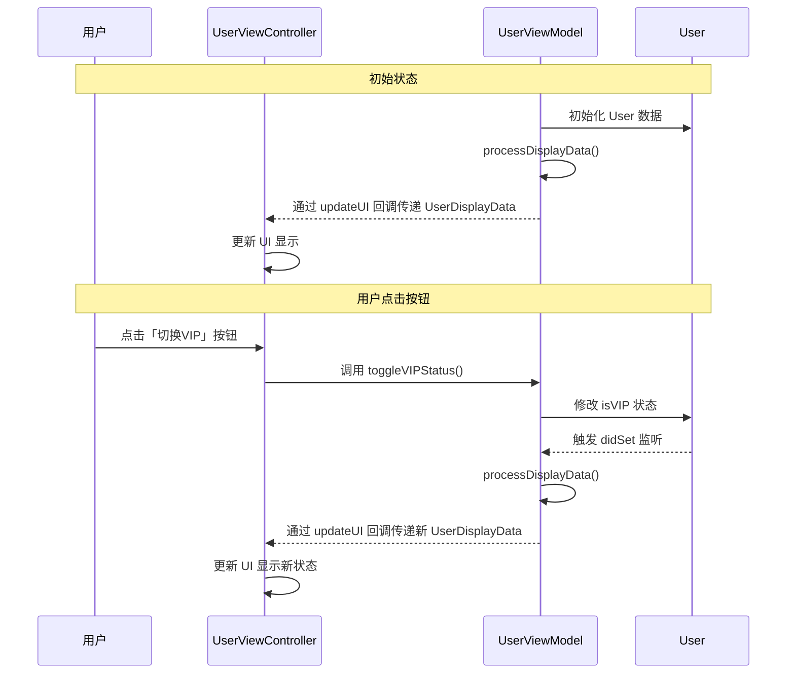
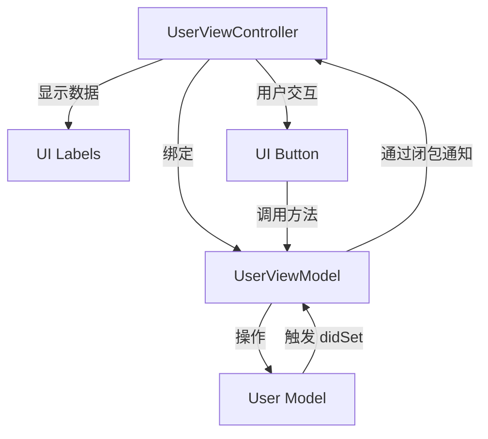

以下是使用 Mermaid 绘制的[[001 MVVM]]代码示例 **MVVM 响应流程图**，清晰展示代码示例中的交互流程：
![[MVVM 响应流程图.svg]]
%%


%%


---

### 流程关键步骤解析

1. **初始化阶段**  
   - ViewModel 初始化时加载 Model 数据
   - 处理数据生成 `UserDisplayData`
   - 通过闭包将数据传递给 View 更新 UI

2. **用户交互阶段**  
   - 用户点击按钮触发 View 层事件
   - View 调用 ViewModel 的业务方法 `toggleVIPStatus()`
   - ViewModel 修改 Model 的 `isVIP` 状态
   - Model 的 `didSet` 监听触发数据处理逻辑

3. **数据反馈阶段**  
   - ViewModel 将处理后的 `UserDisplayData` 通过闭包回调传递给 View
   - View 根据最新数据更新界面元素

---

### 技术细节说明
1. **数据流向**  
   ```mermaid
   graph LR
   A[用户操作] --> B(View)
   B --> C{ViewModel}
   C --> D[Model]
   D --> C
   C --> B
   B --> E[UI更新]
   ```

2. **响应式机制**  
   - **ViewModel → View**：通过闭包 `updateUI` 实现数据推送
   - **Model → ViewModel**：通过 `didSet` 属性观察者监听变化

3. **无反向依赖**  
   - ViewModel 不持有 View 的强引用
   - 所有通信通过协议或闭包完成

---

### 扩展：完整组件交互图


通过以上图表，可以清晰理解 MVVM 模式中 **数据驱动** 和 **单向流动** 的核心设计思想。