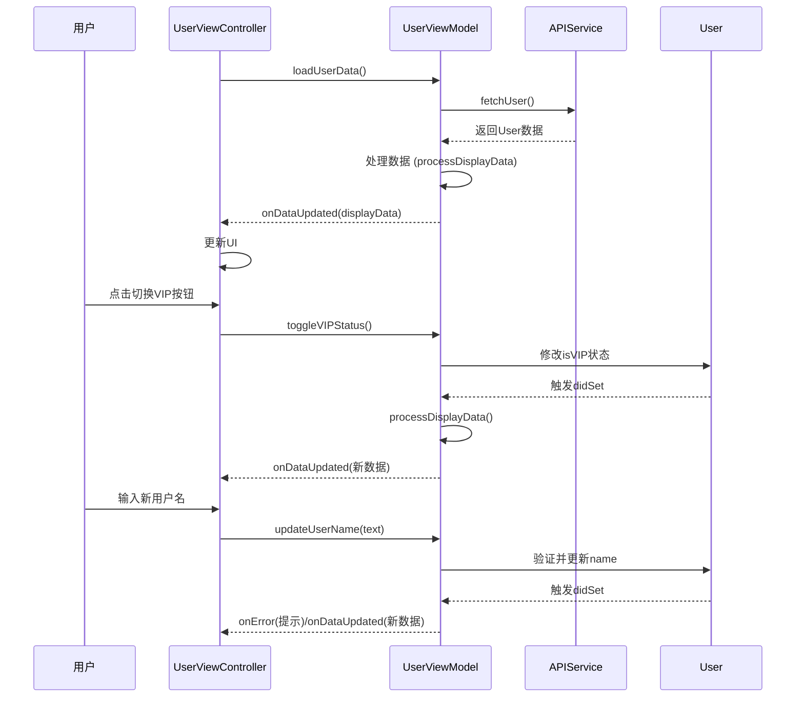

以下是基于之前 MVVM 示例的 **功能扩展实现**，通过协议和闭包实现更规范的模块通信，同时增加网络请求和错误处理功能：

---

### 一、协议定义（核心解耦）
```swift
// MARK: - 协议定义
protocol UserViewModelProtocol: AnyObject {
    // 数据绑定
    var onLoading: ((Bool) -> Void)? { get set }
    var onDataUpdated: ((UserDisplayData) -> Void)? { get set }
    var onError: ((String) -> Void)? { get set }
    
    // 业务方法
    func loadUserData()
    func toggleVIPStatus()
    func updateUserName(_ name: String)
}
```

---

### 二、ViewModel 实现（完整版）
```swift
class UserViewModel: UserViewModelProtocol {
    
    // MARK: - 数据绑定闭包
    var onLoading: ((Bool) -> Void)?
    var onDataUpdated: ((UserDisplayData) -> Void)?
    var onError: ((String) -> Void)?
    
    // MARK: - 业务数据
    private var user: User? {
        didSet {
            guard let user = user else { return }
            processDisplayData(user)
        }
    }
    
    private let apiService: UserAPIServiceProtocol
    
    // 依赖注入（便于测试）
    init(apiService: UserAPIServiceProtocol = UserAPIService()) {
        self.apiService = apiService
    }
    
    // MARK: - 业务逻辑
    func loadUserData() {
        onLoading?(true)
        
        apiService.fetchUser { [weak self] result in
            self?.onLoading?(false)
            
            switch result {
            case .success(let user):
                self?.user = user
            case .failure(let error):
                self?.onError?(error.localizedDescription)
            }
        }
    }
    
    func toggleVIPStatus() {
        guard var user = user else { return }
        user.isVIP.toggle()
        self.user = user // 触发 didSet
    }
    
    func updateUserName(_ name: String) {
        guard !name.isEmpty else {
            onError?("用户名不能为空")
            return
        }
        
        guard var user = user else { return }
        user.name = name
        self.user = user
    }
    
    // MARK: - 数据处理
    private func processDisplayData(_ user: User) {
        let displayData = UserDisplayData(
            name: "姓名: \(user.name)",
            email: "邮箱: \(user.email)",
            status: user.isVIP ? "🌟 VIP" : ""
        )
        onDataUpdated?(displayData)
    }
}
```

---

### 三、网络服务层（协议+实现）
```swift
// 网络服务协议
protocol UserAPIServiceProtocol {
    func fetchUser(completion: @escaping (Result<User, Error>) -> Void)
}

// 具体实现
class UserAPIService: UserAPIServiceProtocol {
    func fetchUser(completion: @escaping (Result<User, Error>) -> Void) {
        // 模拟网络请求
        DispatchQueue.global().asyncAfter(deadline: .now() + 1) {
            let user = User(id: 1, name: "张三", email: "zhangsan@example.com", isVIP: false)
            completion(.success(user))
            
            // 模拟错误
            // completion(.failure(NSError(domain: "com.example", code: 500)))
        }
    }
}
```

---

### 四、View 控制器实现（完整交互）
```swift
class UserViewController: UIViewController {
    
    // MARK: - UI 组件
    private let nameLabel = UILabel()
    private let emailLabel = UILabel()
    private let statusLabel = UILabel()
    private let toggleButton = UIButton(type: .system)
    private let nameTextField = UITextField()
    private let loadingIndicator = UIActivityIndicatorView(style: .medium)
    
    private var viewModel: UserViewModelProtocol!
    
    // MARK: - 生命周期
    override func viewDidLoad() {
        super.viewDidLoad()
        setupUI()
        setupViewModel()
        viewModel.loadUserData()
    }
    
    // MARK: - UI 设置
    private func setupUI() {
        view.backgroundColor = .white
        
        // 布局代码略...
        nameTextField.addTarget(self, action: #selector(nameDidChange), for: .editingChanged)
        toggleButton.addTarget(self, action: #selector(didTapButton), for: .touchUpInside)
    }
    
    // MARK: - ViewModel 绑定
    private func setupViewModel() {
        viewModel = UserViewModel()
        
        viewModel.onLoading = { [weak self] isLoading in
            isLoading ? self?.loadingIndicator.startAnimating() : self?.loadingIndicator.stopAnimating()
        }
        
        viewModel.onDataUpdated = { [weak self] data in
            self?.nameLabel.text = data.name
            self?.emailLabel.text = data.email
            self?.statusLabel.text = data.status
        }
        
        viewModel.onError = { [weak self] message in
            let alert = UIAlertController(title: "错误", message: message, preferredStyle: .alert)
            alert.addAction(UIAlertAction(title: "确定", style: .default))
            self?.present(alert, animated: true)
        }
    }
    
    // MARK: - 用户交互
    @objc private func didTapButton() {
        viewModel.toggleVIPStatus()
    }
    
    @objc private func nameDidChange() {
        viewModel.updateUserName(nameTextField.text ?? "")
    }
}
```

---

### 五、Mermaid 交互流程图
![[003 Mermaid 交互流程图.svg]]
%%

%%


---

### 六、关键优化点说明

1. **协议解耦**  
   - 定义 `UserViewModelProtocol` 和 `UserAPIServiceProtocol`  
   - 实现模块间依赖接口而非具体实现，方便单元测试和替换实现

2. **状态管理闭环**  
   - 通过 `onLoading` 闭包控制加载指示器  
   - 通过 `onError` 统一处理错误提示

3. **数据流清晰化**  
   - 用户输入通过 `nameDidChange` 实时同步到 ViewModel  
   - ViewModel 处理数据验证和业务逻辑

4. **依赖注入**  
   ```swift
   init(apiService: UserAPIServiceProtocol = UserAPIService())
   ```
   支持在测试时注入 Mock 服务

---

### 七、单元测试示例
```swift
class MockAPIService: UserAPIServiceProtocol {
    var result: Result<User, Error>!
    func fetchUser(completion: @escaping (Result<User, Error>) -> Void) {
        completion(result)
    }
}

class UserViewModelTests: XCTestCase {
    func testVIPToggle() {
        // 准备
        let mockService = MockAPIService()
        let vm = UserViewModel(apiService: mockService)
        vm.user = User(id: 1, name: "Test", email: "test@example.com", isVIP: false)
        
        // 操作
        vm.toggleVIPStatus()
        
        // 断言
        XCTAssertTrue(vm.user?.isVIP == true)
    }
}
```

---

通过以上扩展，代码实现了：
- 完整的网络请求流程
- 用户输入实时验证
- 错误统一处理
- 协议化模块解耦
- 可测试性增强

这种设计模式特别适合中大型项目，能显著提升代码的可维护性和扩展性。