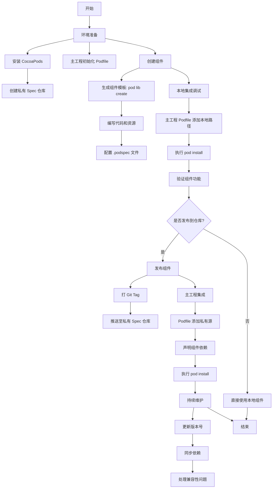
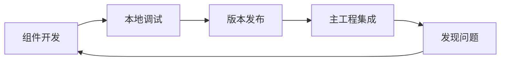

![[CocoaPods 组件化开发流程.svg]]

以下是使用 Mermaid 绘制的 CocoaPods 组件化开发核心流程图：

### 流程说明：
#### 1. **环境准备**  
   - 安装 CocoaPods 工具链  
   - 为组件化创建私有 Spec 仓库（用于存储组件描述文件）  
   - 在主工程初始化 Podfile

#### 2. **创建组件**  
   - 使用 `pod lib create` 生成标准化组件模板  
   - 在 `Classes` 和 `Assets` 目录添加代码与资源  
   - 配置 `.podspec` 文件声明元数据和依赖

#### 3. **本地集成调试**  
   - 通过 `:path => '本地路径'` 方式引用组件  
   - 验证组件与主工程的集成效果

#### 4. **发布决策**  
   - 选择直接使用本地组件（适合快速迭代）  
   - 或发布到私有仓库（适合团队协作）

#### 5. **发布组件**  
   - 通过 Git Tag 标记版本  
   - 将 `.podspec` 推送到私有 Spec 仓库

#### 6. **主工程集成**  
   - 在 Podfile 中声明私有源地址  
   - 按版本号引用已发布的组件

#### 7. **持续维护**  
   - 遵循语义化版本更新规则  
   - 处理组件版本升级和依赖冲突

---

### 配套操作示意图（横向流程）：

**提示**：实际开发中建议使用工具链加速流程：
- 使用 `cocoapods-generate` 快速生成组件模板
- 通过 `pod lib lint` 验证 .podspec 配置
- 使用 `Fastlane` 自动化发布流程